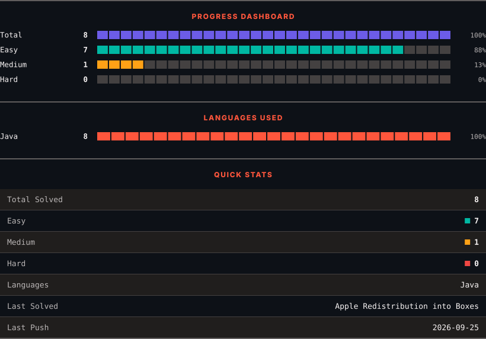
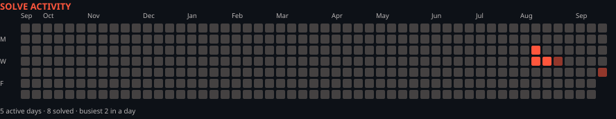

<h1>LeetCode Solutions</h1>

<em>Automatically synced with every accepted submission</em>

   

<picture>
  <source media="(prefers-color-scheme: dark)" srcset=".leetsync/stats-dark.svg">
  <source media="(prefers-color-scheme: light)" srcset=".leetsync/stats-light.svg">
  
</picture>

<picture>
  <source media="(prefers-color-scheme: dark)" srcset=".leetsync/calendar-dark.svg">
  <source media="(prefers-color-scheme: light)" srcset=".leetsync/calendar-light.svg">
  
</picture>

---

### ALL SOLUTIONS

| # | Problem | Difficulty | Language | Date |
|:---:|:--------|:----------:|:--------:|:----:|
| 485 | [Max Consecutive Ones](problems/0485-Max-Consecutive-Ones) | 🟩 Easy | `Java` | 2026-08-19 |
| 561 | [Array Partition](problems/0561-Array-Partition) | 🟩 Easy | `Java` | 2026-08-11 |
| 686 | [Repeated String Match](problems/0686-Repeated-String-Match) | 🟧 Medium | `Java` | 2026-09-25 |
| 860 | [Lemonade Change](problems/0860-Lemonade-Change) | 🟩 Easy | `Java` | 2026-08-11 |
| 1005 | [Maximize Sum Of Array After K Negations](problems/1005-Maximize-Sum-Of-Array-After-K-Negations) | 🟩 Easy | `Java` | 2026-08-12 |
| 1480 | [Running Sum of 1d Array](problems/1480-Running-Sum-of-1d-Array) | 🟩 Easy | `Java` | 2026-08-19 |
| 1672 | [Richest Customer Wealth](problems/1672-Richest-Customer-Wealth) | 🟩 Easy | `Java` | 2026-08-26 |
| 3074 | [Apple Redistribution into Boxes](problems/3074-Apple-Redistribution-into-Boxes) | 🟩 Easy | `Java` | 2026-08-12 |

---

Auto-synced by <strong>LeetSync</strong> · Built by <a href="https://deveshsamant.in/">Devesh Samant</a>

