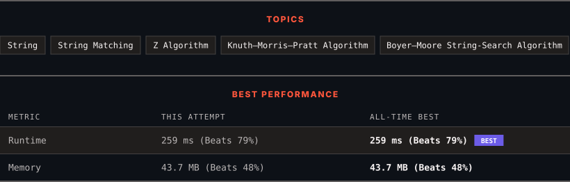

<div align="center">

# 686. Repeated String Match

      

[](https://leetcode.com/problems/repeated-string-match/)

</div>

---

<div align="center">

<picture>
  <source media="(prefers-color-scheme: dark)" srcset="panel-dark.svg">
  <source media="(prefers-color-scheme: light)" srcset="panel-light.svg">
  
</picture>

</div>

> **New personal best** — Runtime improved on this submission.

### HOW IT WENT

| | |
|:--|:--|
| **Attempts** | first try |
| **Time to solve** | 18 min |
| **Verdicts** | ✅ Accepted |

---

### NOTES

_No notes yet._

---

### SOLUTIONS (1)

| # | File | Language | Date |
|:-:|------|:--------:|:----:|
| 1 | [sol1.java](./sol1.java) | `Java` | 2026-09-24 ← **latest** |

---

### PROBLEM DESCRIPTION

Given two strings `a` and `b`, return *the minimum number of times you should repeat string *`a`* so that string* `b` *is a substring of it*. If it is impossible for `b`​​​​​​ to be a substring of `a` after repeating it, return `-1`.

**Notice:** string `"abc"` repeated 0 times is `""`, repeated 1 time is `"abc"` and repeated 2 times is `"abcabc"`.

 

**Example 1:**

```

**Input:** a = "abcd", b = "cdabcdab"
**Output:** 3
**Explanation:** We return 3 because by repeating a three times "ab**cdabcdab**cd", b is a substring of it.

```

**Example 2:**

```

**Input:** a = "a", b = "aa"
**Output:** 2

```

 

**Constraints:**

	- `1 <= a.length, b.length <= 10^4`

	- `a` and `b` consist of lowercase English letters.

---

<div align="center">

<sub>Auto-synced by <strong>LeetSync</strong> · Built by <a href="https://deveshsamant.in/">Devesh Samant</a></sub>

</div>
