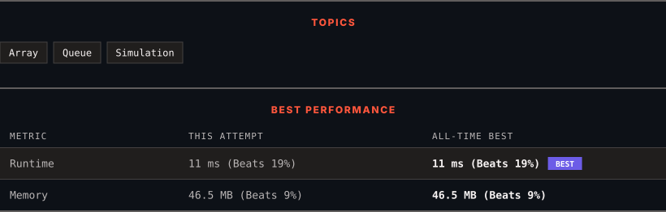

# 2073. Time Needed to Buy Tickets

      

---

<picture>
  <source media="(prefers-color-scheme: dark)" srcset="panel-dark.svg">
  <source media="(prefers-color-scheme: light)" srcset="panel-light.svg">
  
</picture>

> **New personal best** — Runtime improved on this submission.

### HOW IT WENT

| | |
|:--|:--|
| **Attempts** | first try |
| **Time to solve** | 43 min |
| **Verdicts** | ✅ Accepted |

---

### NOTES

_No notes yet._

---

### SOLUTIONS (1)

| # | File | Language | Date |
|:-:|------|:--------:|:----:|
| 1 | [sol1.java](./sol1.java) | `Java` | 2026-10-05 ← **latest** |

---

### PROBLEM DESCRIPTION

There are `n` people in a line queuing to buy tickets, where the `0^th` person is at the **front** of the line and the `(n - 1)^th` person is at the **back** of the line.

You are given a **0-indexed** integer array `tickets` of length `n` where the number of tickets that the `i^th` person would like to buy is `tickets[i]`.

Each person takes **exactly 1 second** to buy a ticket. A person can only buy **1 ticket at a time** and has to go back to **the end** of the line (which happens **instantaneously**) in order to buy more tickets. If a person does not have any tickets left to buy, the person will **leave **the line.

Return the **time taken** for the person **initially** at position **k**** **(0-indexed) to finish buying tickets.

 

**Example 1:**

**Input:** tickets = [2,3,2], k = 2

**Output:** 6

**Explanation:**

	- The queue starts as [2,3,2], where the kth person is underlined.

	- After the person at the front has bought a ticket, the queue becomes [3,2,1] at 1 second.

	- Continuing this process, the queue becomes [2,1,2] at 2 seconds.

	- Continuing this process, the queue becomes [1,2,1] at 3 seconds.

	- Continuing this process, the queue becomes [2,1] at 4 seconds. Note: the person at the front left the queue.

	- Continuing this process, the queue becomes [1,1] at 5 seconds.

	- Continuing this process, the queue becomes [1] at 6 seconds. The kth person has bought all their tickets, so return 6.

**Example 2:**

**Input:** tickets = [5,1,1,1], k = 0

**Output:** 8

**Explanation:**

	- The queue starts as [5,1,1,1], where the kth person is underlined.

	- After the person at the front has bought a ticket, the queue becomes [1,1,1,4] at 1 second.

	- Continuing this process for 3 seconds, the queue becomes [4] at 4 seconds.

	- Continuing this process for 4 seconds, the queue becomes [] at 8 seconds. The kth person has bought all their tickets, so return 8.

 

**Constraints:**

	- `n == tickets.length`

	- `1 <= n <= 100`

	- `1 <= tickets[i] <= 100`

	- `0 <= k < n`

---

Auto-synced by <strong>LeetSync</strong> · Built by <a href="https://deveshsamant.in/">Devesh Samant</a>

